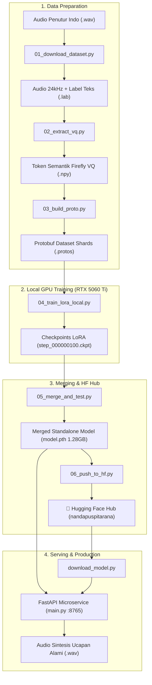

# 🐟 Fish-Speech 1.5 — Indonesian TTS Microservice & Fine-Tuning Pipeline

Layanan mandiri (*microservice*) sintesis suara (*Text-to-Speech*) Bahasa Indonesia berbasis arsitektur **Dual-AR Transformer** dari Fish-Speech 1.5 dengan neural vocoder **Firefly-GAN VQ**.

Model hasil fine-tuning ini telah digabungkan secara penuh (*merged standalone weights*) dan dipublikasikan di **Hugging Face Hub**:
🔗 **[huggingface.co/nandapuspitarana/fish-speech-1.5-indonesian](https://huggingface.co/nandapuspitarana/fish-speech-1.5-indonesian)**

---

## 📑 Daftar Isi
- [Arsitektur & Diagram Alur](#-arsitektur--diagram-alur)
- [Master Pipeline Runner (`pipeline.py`)](#-master-pipeline-runner-pipelinepy)
- [Tahapan Pelatihan Lengkap (Step-by-Step)](#-tahapan-pelatihan-lengkap-step-by-step)
- [Hasil Evaluasi & Metrik Pelatihan](#-hasil-evaluasi--metrik-pelatihan)
- [Deploy & Menjalankan Server API](#-deploy--menjalankan-server-api)
- [Struktur Direktori Proyek](#-struktur-direktori-proyek)

---

## 🏛️ Arsitektur & Diagram Alur



---

## 🎮 Master Pipeline Runner (`pipeline.py`)

Untuk mempermudah menjalankan seluruh alur dari awal hingga akhir, gunakan skrip orkestrator **`pipeline.py`**.

### 1. Menu Interaktif (Mudah & Visual)
Cukup jalankan:
```powershell
cd services/fish-speech
python pipeline.py
```
Akan muncul menu interaktif:
```text
  [1] 📥 Download Pretrained Base Model (fish-speech-1.5)
  [2] 🎙️ Siapkan Dataset Suara Bahasa Indonesia (01_download_dataset)
  [3] ⚡ Ekstraksi Token Semantik Audio (02_extract_vq)
  [4] 📦 Bangun Protobuf Dataset Shards (03_build_proto)
  [5] 🚀 Latih Dual-AR LoRA di GPU Lokal (04_train_lora_local)
  [6] 🐟 Gabungkan Bobot LoRA & Uji Sintesis Audio (05_merge_and_test)
  [7] 🤗 Upload Model ke Hugging Face Hub (06_push_to_hf)
  [8] 📥 Tarik Model Bahasa Indonesia dari Hugging Face Hub
  [9] 🌐 Jalankan Server API FastAPI (main.py)
  [10]🎯 Jalankan Pipeline Penuh End-to-End (1 sampai 6)
```

### 2. Eksekusi Non-Interaktif (CLI Flags)
Cocok untuk automation, script CI/CD, atau background task:
```powershell
# Jalankan pelatihan lokal saja
python pipeline.py --stage train --max-steps 100 --val-interval 25

# Gabungkan bobot dan uji suara
python pipeline.py --stage merge

# Upload ke Hugging Face
python pipeline.py --stage push

# Jalankan server API TTS
python pipeline.py --stage serve --port 8765

# Jalankan seluruh pipeline 1 s/d 6 secara berurutan
python pipeline.py --stage all
```

---

## 🛠️ Tahapan Pelatihan Lengkap (Step-by-Step)

Jika Anda ingin menjalankan masing-masing skrip individual secara manual:

### Tahap 1: Siapkan Dataset Audio & Transkrip
```powershell
python training/01_download_dataset.py
```
* Mengunduh/menyiapkan 60 segmen rekaman suara penutur Bahasa Indonesia.
* Memastikan format audio: **24 kHz, 16-bit Mono PCM**.
* Menghasilkan file audio `.wav` dan transkrip teks `.lab`.

### Tahap 2: Ekstraksi Token Semantik (VQGAN)
```powershell
python training/02_extract_vq.py
```
* Menggunakan neural audio codec Firefly-GAN (8 codebooks @ 21.5 Hz).
* Mengekstrak audio menjadi file token semantik diskrit (`.npy`).
* Kecepatan: ~5-10 detik untuk seluruh 60 file pada GPU RTX 5060 Ti.

### Tahap 3: Packing Protobuf Shards
```powershell
python training/03_build_proto.py
```
* Membaca file `.lab` dan `.npy`.
* Menggabungkannya ke dalam format binary stream protocol buffers: `data/protos/00000000.protos`.

### Tahap 4: Pelatihan LoRA di GPU Lokal
```powershell
python training/04_train_lora_local.py --max-steps 100 --val-interval 25
```
* Menggunakan arsitektur Dual-AR Transformer dengan modul LoRA ($r=8, \alpha=16$).
* Melatih 6.2 juta parameter LoRA dengan presisi penuh perangkat keras `bfloat16`.
* Menyimpan checkpoint setiap 25 steps di: `fish-speech-repo/results/indonesia-tts-local/checkpoints/`.

### Tahap 5: Penggabungan Bobot (*Merge*) & Uji Sintesis
```powershell
python training/05_merge_and_test.py \
  --lora-checkpoint fish-speech-repo/results/indonesia-tts-local/checkpoints/step_000000100.ckpt \
  --output checkpoints/indonesia-tts-local-merged
```
* Menggabungkan parameter LoRA secara permanen ke bobot base transformer (`model.pth` 1.28 GB).
* Menyalin tokenizer dan Firefly decoder generator ke folder output.
* Menghasilkan file audio uji coba: `test_indonesia_merged.wav`.

### Tahap 6: Publikasikan ke Hugging Face Hub
```powershell
python training/06_push_to_hf.py \
  --repo-id nandapuspitarana/fish-speech-1.5-indonesian \
  --token <hf_write_token>
```
* Otomatis mengunggah bobot model lengkap, Model Card `README.md`, dan audio demo.

---

## 📈 Hasil Evaluasi & Metrik Pelatihan

Model menunjukkan konvergensi yang sangat stabil dan cepat pada GPU RTX 5060 Ti:

| Evaluasi | Total Loss | Base Loss | Semantic Loss | Top-5 Accuracy | Checkpoint File |
| :--- | :---: | :---: | :---: | :---: | :--- |
| **Step 25** | `7.9062` | `4.0000` | `3.9062` | `37.11%` | `step_000000025.ckpt` |
| **Step 50** | `6.5938` | `3.3438` | `3.2500` | `50.39%` | `step_000000050.ckpt` |
| **Step 75** | `5.5312` | `2.6250` | `2.9062` | `58.20%` | `step_000000075.ckpt` |
| **Step 100** | **`4.1250`** | **`1.4609`** | **`2.6562`** | **`63.67%`** | `step_000000100.ckpt` |

---

## 🚀 Deploy & Menjalankan Server API

### Menjalankan Server API secara Lokal
```powershell
# Menggunakan pipeline runner
python pipeline.py --stage serve

# Atau langsung via uvicorn
uvicorn main:app --host 0.0.0.0 --port 8765
```

### Menjalankan via Docker Compose
```powershell
docker compose up fish-speech -d
```

### Contoh Request Sintesis Suara (cURL)
```bash
curl -X POST http://localhost:8765/v1/tts \
  -H "Content-Type: application/json" \
  -d '{
    "text": "Selamat datang di generator konten otomatis kami!",
    "speaker_id": "indonesia_native",
    "format": "wav"
  }' --output hasil_suara.wav
```

### Response Kesehatan Server (`/v1/health`)
```json
{
  "status": "healthy",
  "device": "cuda",
  "active_checkpoint": "indonesia-tts-local-merged (LoRA Fine-tuned Indonesian)",
  "version": "1.5.0"
}
```

---

## 📁 Struktur Direktori Proyek

```text
services/fish-speech/
├── checkpoints/
│   ├── fish-speech-1.5/                      # Pretrained base weights
│   └── indonesia-tts-local-merged/           # Merged fine-tuned model (100% Standalone)
│       ├── config.json
│       ├── model.pth                         (1.28 GB)
│       ├── firefly-gan-vq...generator.pth    (188.5 MB)
│       ├── tokenizer.tiktoken                (1.8 MB)
│       └── README.md
├── data/
│   ├── Speaker_Indonesia/                    # Dataset teks transkrip (.lab)
│   └── protos/                               # Shards protobuf dataset
├── training/
│   ├── 01_download_dataset.py                # Unduh & potong dataset suara
│   ├── 02_extract_vq.py                      # Ekstraksi VQGAN semantik
│   ├── 03_build_proto.py                     # Buat protobuf dataset
│   ├── 04_train_lora_local.py                # Fine-tuning GPU RTX lokal
│   ├── 05_merge_and_test.py                  # Penggabungan bobot & test sintesis
│   └── 06_push_to_hf.py                      # Upload ke Hugging Face Hub
├── download_model.py                         # Downloader model offline
├── pipeline.py                               # Master CLI Orchestrator
├── main.py                                   # FastAPI TTS Microservice
└── Dockerfile                                # Kontainerisasi microservice
```
